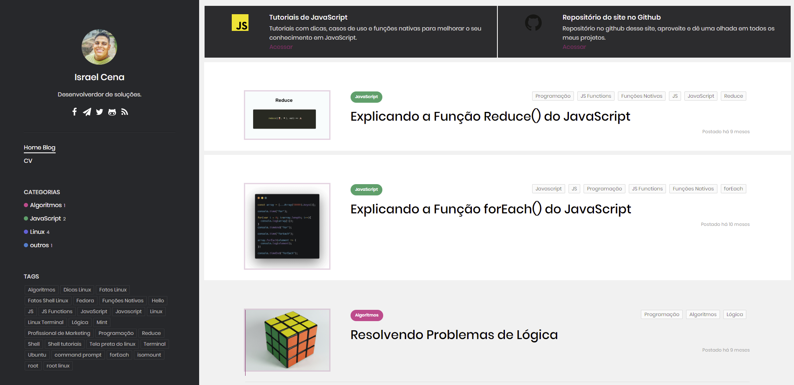

# My Own Personal Blog

Personal blog built with [React](https://reactjs.org/), powered by [Gatsby](https://www.gatsbyjs.com/) and freely hosted in [Netlify](https://www.netlify.com/).
In this blog I wanted to mix as many resources as possible in order to learn.


[](https://github.com/tterb/atomic-design-ui/blob/master/LICENSEs)


## Screenshots




## Stacks

- [Ant Design](https://ant.design/docs/react/introduce) 
- [Gatsby](https://www.gatsbyjs.com/)
- [Netlify cms](https://www.netlifycms.org/)
- [Tailwindcss](https://tailwindcss.com/)
- [Disqus-comments](https://blog.disqus.com/)
- [Dayjs](https://day.js.org/)
- [PrismJS](https://prismjs.com/)
- [word-per-minute](https://www.npmjs.com/package/word-per-minute) - My own

## Instalation

before clone this project, if you use yarn:

```bash
  yarn 
  yarn dev
```
    
## Authors

- [IsraelCena](https://www.github.com/israelcena)

#### Demo
[Click me!](https://blog.israelcena.com.br/)

